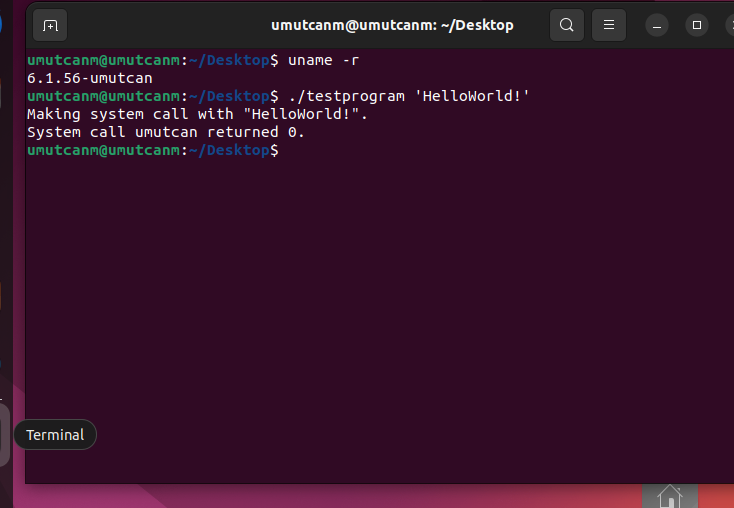

## Kernel Compile and Write System Call   

### Adım 1:
İlk adım olarak eğer bilgisarınızda linux kurulu değilse virtual box veya vmware indirip ardından sanal makine için bir linux sürümü indirmelisiniz.  
Virtual box indirme linki:  
<a href="https://www.virtualbox.org/wiki/Downloads" target="_blank">VirtualBox</a>  
<br>

Linux ubuntu indirme linki:  
<a href="https://ubuntu.com/download/desktop" target="_blank">Ubuntu</a>  
<br>
#### NOT
**Ubuntu için virtual boxta kurarken en az 60 gb yer ayırmanızı öneririm kernel derlenirken düşük bellek hatası almamak için. Ayrıca settings kısmından ram kısmına mümkün olduğunca yüksek değer vermeye çalışın yeşil kısmında kalmak şartıyla, sınır değeri vermeyin ve çekirdek kısmında da ne kadar çok verirseniz o kadar hızlı derlenir yine yeşil kısımda kalmak şartıyla tabi.**  


_______________
### Adım 2:  


Sıra ubuntu içinde kernel indirmeye geldi.
<br>  
Bunun için öncelikle terminalde
<br>
```      
uname -r
```
<br>
komutunu çalıştırarak kernel sürümünüzü kontrol edin.
<br>
Ardından:
<br>
<a href="https://kernel.org/" target="_blank">Kernel install</a>  
<br>
kısmından sürümünüzle aynı veya en yakın kernel sürümünü tarball olarak indirin.

_______________
### Adım 3:  
#### Bu adımdan sonraki her adımı root kullanıcı olarak gerçekleştirin. Aksi halde hata alabilirsiniz. 

İndirdiğiniz kernelin dizinine gidin ve tar şeklindeki kernel dosyasını şu komutla çıkarın:  
```
tar xvf linux-6.0.7.tar.xz
```   
**(burada 6.0.7 yerine sizin indirdiğiniz versiyon olacak)**  


ardından ek paketleri indirin:  
```
sudo apt-get install git fakeroot build-essential ncurses-dev xz-utils libssl-dev bc flex libelf-dev bison
```  
**bu compile derlenirken minimum hata almanıza yardımcı olacak**

**compile derlemeye başlamadan önce şu komutları da çalıştırarak hata riskini mimimuma indirin:
```
sudo update 
```

```
sudo upgrade 
```


_______________
### Adım 4:  


Tardan çıkardığınız kernel dosyasına girin:    
<br>
```
cd linux-Version
```  
<br>
<br>


Ardından sizin mevcut kerneldaki config dosyasınızı tardan çıkardığınız kernel dosyasına kopyalamanız gerekiyor. Bunun içinde:
<br>
```
cp -v /boot/config-$(uname -r) .config
```
<br>
komutunu giriniz.  

**Bu kısımda ubuntu kullanıyorsanız bu komut geçerli. Başka bir linux sisteminde komut değişir.**


_______________
### Adım 5:  


Sonrasında şu komutu çalıştırın:
<br>
```
yes "" | make oldconfig
```
_______________
### Adım 6:  


Oluşturulan config dosyasına girerek **CONFIG_LOCALVERSION=""** kısmını editlemeniz gerekir. Bunun için terminalden:
<br>
```
nano .config
```
<br>
komutu çalıştırarak girebilirsiniz. Ardından eğer editleyeceğiniz kısmı göremediyseniz **Control + W** ile search edip bulabilirsiniz.
(büyük küçük harf ve türkçe harf kullanımına dikkat ediniz)
<br>

**CONFIG_LOCALVERSION="-kendiisminiz"** şeklinde değiştirin.

Ardından compile aşamasında sertifikalarla ilgili hata alma riskine karşı compile etmeden önce aynı dosya da  
**CONFIG_SYSTEM_TRUSTED_KEYS=""**  
**CONFIG_SYSTEM_REVOCATION_KEYS=""**  
kısımlarını içi boş olacak şekilde düzenleyin. Bunu ister manuel olarak yapabilir;  
bunun için **nano .config** ile girip **control + W** ile bunları aratıp benzer şekilde düzenleyin ya da;  
```
scripts/config --disable SYSTEM_TRUSTED_KEYS
```


```
scripts/config --disable SYSTEM_REVOCATION_KEYS
```  

şeklinde terminal üzerinden disable edebilirsiniz.(Manuel olarak yapmanızı öneririm. Bazen disable etmenize rağmen hata veriyorlar.)  


_______________
### Adım 7:  


İndirilen kernel dosyasında şu dosyayı açın:
```
nano arch/x86/entry/syscalls/syscall_64.tbl
```

Bu dosya system call ekleyeceğimiz dosyadır. O yüzden bu dosyada 300lü system callların sonuna bir sonraki numara ile kendi system callunuzu
ekleyin. Sıradaki numara 335 ise:
<p> 
  <strong>(Aralarda tab kadar boşluk vardır) 
  </strong>
</p>  


```
335  common  kendiisminiz      sys_kendiisminiz
```


<br>
Eğer sisteminiz 64 bit ise tablonun en sonuna da yazabilirsiniz system callu. Tabi o zaman 335 numarası değişecek.  


_______________
### Adım 8:  
Bu adımda kernel dosyasında kernel/sys.c dosyasını açarak en sonuna şu kodu eklemelisiniz: (Kendi system callunuza göre kodu düzeltin)
```
SYSCALL_DEFINE1(kendiisminiz, char *, msg)
{
  char buf[256];
  long copied = strncpy_from_user(buf, msg, sizeof(buf));
  if (copied < 0 || copied == sizeof(buf))
    return -EFAULT;
  printk(KERN_INFO "kendiisminiz syscall called with \"%.256s\"\n", buf);
  return 0;
}
```

**Bu fonksiyonun herhangi bir if vb macro bloğunun içinde olmamasına dikkat edin.**


_______________
### Adım 9:
KERNEL COMPİLE VE İNSTALL
Öncelikle indirilen kernel dosyasının başlangıç dizinine geliniz. Yani şöyle bir dizinde olduğunuzdan emin olduktan sonra:
<br>
```    linux-VERSION$    ```
<br>
<a href="https://github.com/UmutcanMert/Kernel-Compile-and-Write-System-Call/blob/master/deploy.sh" target="_blank">deploy.sh</a> dosyasındaki komutları aynen yazınız ve kaydedip çıkınız.Ve bu dosyayı terminalde çalıştırmak için:
```
chmod u+x deploy.sh
```

```
./deploy.sh
```

<br>
komutlarını çalıştırın. En son çalıştırdığınız komut ile birlikte kernel compile olmaya başladı. Eğer bir hata almadan kernel compile edilirse başarıyla eklendi. En son sistemi yeniden başlatıp GRUB menüden oluşturduğunuz kernel sürümüne tıklayın.  
<br>

**reboot** et ve sonra ubuntu açılırken **ESC** tuşuna bas ya basılı tut. Ardından advanced options kısmından kendi kernelını seçebilirsin.


________________
### Adım 9:  
Gelelim son adıma yani system callumuzu test etmeye. Bakalım doğru yazmışmıyız. Öncelikle GRUB menüden seçtiğiniz kernelda bir testprogram.c adında dosya oluşturun:
```
touch testprogram.c 
```

ardından bu dosyaya girerek şunları yazın:(Tabi burada kendi system callunuza göre kodu düzenlemeniz gerekiyor, system call no - syscall call name gibi)
```
/**
 * Test the stephen syscall (#3..)
 */
#define _GNU_SOURCE
#include <unistd.h>
#include <sys/syscall.h>
#include <stdio.h>
#include <errno.h>

/*
 * Put your syscall number here.
 */
#define SYS_kendiisminiz 335 /*syscall table daki no ile ayni olmali*/

int main(int argc, char **argv)
{
  if (argc <= 1) {
    printf("Must provide a string to give to system call.\n");
    return -1;
  }
  char *arg = argv[1];
  printf("Making system call with \"%.50s\".\n", arg);
  long res = syscall(SYS_kendiisminiz, arg); /*yani syscall(335,arg)*/

  if (res == -1)
    fprintf(stderr, "kendiisminiz failed, errno = %d\n", errno);
  else
    printf("System call kendiisminiz returned %ld.\n", res);
  return res;
}
```

Bunu da yaptıktan sonra kaydedip çıkın ve kodu derleyin:
```
gcc -o testprogram.c testprogram
```
<br>
ardından:  

```
./testprogram 'helloworld!'
```


komutunu çalıştırın.Eğer resimdeki gibi çıktıya benzer bir output ile karşılaştıysan tebrik ederim. Çünkü bir kernel derleyip system call ekledin ve başarıyla sonuçlandırdın.:)))  



________________
### ÖNEMLİ NOT
### KARŞILAŞILABİLECEK MUHTEMEL HATALAR ile ilgili:    
Burada belli başlı hatalarla ilgili kaynaklar vardır. Burada olmayan herhangi bir hata ile karşılaşırsanız direk hatayı yazıp araştırın.

--> Compiling kernel gives error No rule to make target 'debian/certs/debian-uefi-certs.pem':  
<a href="https://stackoverflow.com/questions/67670169/compiling-kernel-gives-error-no-rule-to-make-target-debian-certs-debian-uefi-ce" target="_blank" >https://stackoverflow.com/questions/67670169/compiling-kernel-gives-error-no-rule-to-make-target-debian-certs-debian-uefi-ce</a>  

--> SOLVED-Kernel Compile Error - frame size  
<a href="https://forums.debian.net/viewtopic.php?t=65980" target="_blank" >https://forums.debian.net/viewtopic.php?t=65980</a>  

--> SOLVED-Kernel Compile Error - frame size  
<a href="https://forums.debian.net/viewtopic.php?t=65980" target="_blank" >https://forums.debian.net/viewtopic.php?t=65980</a>

--> Fix You must put some ‘deb-src’ URIs in your sources.list Error  
<a href="https://www.tecmint.com/fix-deb-src-uris-in-your-sources-list-error/" target="_blank" >https://www.tecmint.com/fix-deb-src-uris-in-your-sources-list-error/</a>

